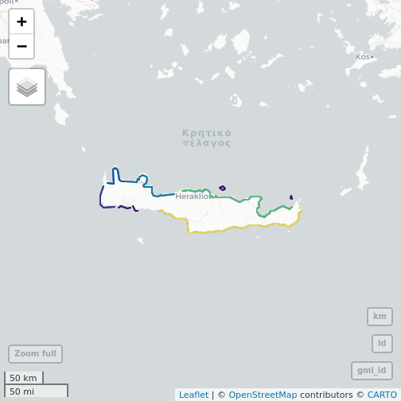

Requesting a full layer with `emodnet_get_layers()` will return the geometries for all features in that layer, potentially a large amount of data. 

Some basic ability to limit the output of any query is possible by providing additional parameters to the feature request query. This can be achieved by passing additional arguments to `emodnet_get_layers(...)`.

For details on all available parameters consult the [`GetFeature` Geoserver documentation](https://docs.geoserver.org/master/en/user/services/wfs/reference.html#getfeature).  Also note that there are [differences in available parameters between different version of WFS specifications](https://docs.geoserver.org/stable/en/user/services/wfs/basics.html#differences-between-wfs-versions). We recommend and mainly document using the default and latest version (`"2.0.0"`) which is supported by all EMODnet WFS services.


## Initialise a WFS client

Let's start by loading emodnet.wfs and initialising a WFS client to the `human_activities` WFS service.


``` r
library(emodnet.wfs)

wfs <- emodnet_init_wfs_client("human_activities")
#> ✔ WFS client created successfully
#> ℹ Service: "https://ows.emodnet-humanactivities.eu/wfs"
#> ℹ Version: "2.0.0"
```


## Return single feature using feature ID

We can restrict the query to a single feature using `featureID` and providing the ID of a specific feature.


``` r
emodnet_get_layers(
  wfs = wfs,
  layers = "pipelines",
  featureID = "pipelines.1",
  simplify = TRUE
)
#> Simple feature collection with 1 feature and 14 fields
#> Geometry type: MULTILINESTRING
#> Dimension:     XY
#> Bounding box:  xmin: -5.87186 ymin: 35.99551 xmax: -5.836784 ymax: 36.12588
#> Geodetic CRS:  WGS 84
#>        gml_id             name   id status medium operator size_in length_m year from_loc to_loc country_co
#> 1 pipelines.1 Gasoducto Magreb <NA> Active   <NA>     <NA>    <NA> 15467.17 <NA>     <NA>   <NA>         ES
#>   country notes                       the_geom
#> 1   Spain  <NA> MULTILINESTRING ((-5.87186 ...
```

## Return specific number of features 

If the ID of the feature is unknown but we still want to limit the number of features returned, we use the `count` parameter for WFS 2.0.0 or the `maxFeatures` parameter for earlier WFS versions to restrict the number of features returned. In this example we restrict the query to the first feature.


``` r
emodnet_get_layers(
  wfs = wfs,
  layers = "pipelines",
  count = 1L,
  simplify = TRUE
)
#> Simple feature collection with 1 feature and 13 fields
#> Geometry type: MULTILINESTRING
#> Dimension:     XY
#> Bounding box:  xmin: 24.98448 ymin: 60.19078 xmax: 25.01292 ymax: 60.19293
#> Geodetic CRS:  WGS 84
#>           gml_id   id status medium operator size_in length_m year from_loc to_loc country_co country
#> 1 pipelines.3463 <NA>    n/a   <NA>     <NA>    <NA>  1628.03 <NA>     <NA>   <NA>         FI Finland
#>                      notes                       the_geom
#> 1 Finnish Transport Agency MULTILINESTRING ((25.01292 ...
```

## Order features

Exactly which features will be returned depends in the internal structure of the data. However, we can sort the returned selection based on an attribute value using the `sortBy` parameter. 

Say we wanted to return 5 of the longest marine pipelines. In the following example, we sort by the `"length_m"` attribute and combine it with the `count` parameter to restrict the number of features returned. This returns the first 5 features after the data has been ordered by `"length_m"`. Some pipelines do not have their lengths recorded, we will skip them with a CQL Filter.


``` r
emodnet_get_layers(
  wfs = wfs,
  layers = "pipelines",
  sortBy = "length_m+D",
  count = 5L,
  simplify = TRUE,
  cql_filter = "length_m IS NOT NULL"
)
#> Simple feature collection with 5 features and 14 fields
#> Geometry type: MULTILINESTRING
#> Dimension:     XY
#> Bounding box:  xmin: 2.249597 ymin: 51.04064 xmax: 28.14228 ymax: 60.52758
#> Geodetic CRS:  WGS 84
#>           gml_id          name        id  status medium         operator size_in  length_m year      from_loc
#> 1 pipelines.3423 NORD STREAM 1      <NA>  Active    Gas   Nord Stream AG      48 2443360.2 2011    Vyborg, RU
#> 2 pipelines.3424 NORD STREAM 2      <NA> Planned    Gas Nord Stream 2 AG      48 1210867.9 2021 Kurgalsky, RU
#> 3   pipelines.52          <NA> PL0187_PR  Active    Gas      Statoil ASA      42  836155.4 <NA>  Draupner (N)
#> 4  pipelines.517      Franpipe    326374  Active    Gas        GASSCO AS      42  832197.9 <NA>    DRAUPNER E
#> 5   pipelines.53          <NA> PL0186_PR  Active    Gas      Statoil ASA      40  807749.5 <NA>  Sleipner (N)
#>           to_loc country_co         country           notes                       the_geom
#> 1     Lubmin, GE     DE, RU Germany, Russia Schematic Route MULTILINESTRING ((18.00045 ...
#> 2     Lubmin, GE     DE, RU Germany, Russia Schematic Route MULTILINESTRING ((28.14228 ...
#> 3 Duinkerken (F)         NL     Netherlands            <NA> MULTILINESTRING ((2.249597 ...
#> 4      DUNKERQUE         NO          Norway            <NA> MULTILINESTRING ((2.458616 ...
#> 5  Zeebrugge (B)         NL     Netherlands            <NA> MULTILINESTRING ((3.298373 ...
```


The default sort operation is to sort in ascending order. Some WFS servers require the sort order to be specified. In this case, append a `+A` to the attribute character string passed to `sortBy`. Conversely, here we add a `+D` to sort in descending order.

## Return blocks of features from specific starting point

Finally in WFS version 2.0.0 (and also available in earlier versions on GeoServer) a `startIndex` parameter was introduced, allowing users to specify the starting index of features to be returned.


```
#> [1] 3951
```

For example, the full `"pipelines"` layer contains 3951 features. 


``` r
n_features <- layer_attributes_tbl(wfs = wfs, layer = "pipelines") |> nrow()

n_features
```


Setting the `startIndex` to `n_features - 4` (3947) returns the last 4 features.


``` r
startIndex <- n_features - 4L
startIndex
#> [1] 3947

emodnet_get_layers(
  wfs = wfs,
  layers = "pipelines",
  startIndex = startIndex,
  simplify = TRUE
)
#> Simple feature collection with 4 features and 14 fields
#> Geometry type: MULTILINESTRING
#> Dimension:     XY
#> Bounding box:  xmin: 3.990801 ymin: 53.53329 xmax: 14.4857 ymax: 55.81712
#> Geodetic CRS:  WGS 84
#>           gml_id          name     id     status medium operator size_in length_m year from_loc to_loc country_co
#> 1 pipelines.3948 Nord Stream 2 154802 Not in use    Gas     <NA>    <NA>       NA <NA>     <NA>   <NA>         DE
#> 2 pipelines.3949 Nord Stream 2 154812 Not in use    Gas     <NA>    <NA>       NA <NA>     <NA>   <NA>         DE
#> 3 pipelines.3950   Wintershall 154982     Active    Gas     <NA>    <NA>       NA <NA>     <NA>   <NA>         DE
#> 4 pipelines.3951       Norpipe 155942     Active    Gas     <NA>    <NA>       NA <NA>     <NA>   <NA>         DE
#>   country notes                       the_geom
#> 1 Germany  <NA> MULTILINESTRING ((14.48506 ...
#> 2 Germany  <NA> MULTILINESTRING ((14.4857 5...
#> 3 Germany  <NA> MULTILINESTRING ((4.058202 ...
#> 4 Germany  <NA> MULTILINESTRING ((4.019116 ...
```


We can also combine `startIndex` and `count` to return specific blocks of features. For example, in the following query we request features 5-9 by supplying a `startIndex` of 4 and  `count` of 5.

Note that `startIndex` uses `0` as a starting index (0 indicates the first feature), hence we set it to `4` in order to start at the 5th feature.


``` r
emodnet_get_layers(
  wfs = wfs,
  layers = "pipelines",
  startIndex = 4L,
  count = 6L,
  simplify = TRUE
)
#> Simple feature collection with 6 features and 13 fields
#> Geometry type: MULTILINESTRING
#> Dimension:     XY
#> Bounding box:  xmin: -8.336029 ymin: 51.19448 xmax: -7.947595 ymax: 51.8236
#> Geodetic CRS:  WGS 84
#>         gml_id     id status medium operator size_in  length_m year    from_loc to_loc country_co country notes
#> 1  pipelines.5 F43__3    n/a   <NA>     <NA>    <NA> 10038.745 <NA>     Kinsale   <NA>         IE Ireland  <NA>
#> 2  pipelines.6 F43__4    n/a   <NA>     <NA>    <NA> 20011.185 <NA> Ballycotton   <NA>         IE Ireland  <NA>
#> 3  pipelines.7 F43__5    n/a   <NA>     <NA>    <NA> 10853.853 <NA>     Kinsale   <NA>         IE Ireland  <NA>
#> 4  pipelines.8 F43__6    n/a   <NA>     <NA>    <NA>  5397.224 <NA>     Kinsale   <NA>         IE Ireland  <NA>
#> 5  pipelines.9 F43__7    n/a   <NA>     <NA>    <NA> 73853.753 <NA>     Kinsale   <NA>         IE Ireland  <NA>
#> 6 pipelines.10 F43__8    n/a   <NA>     <NA>    <NA> 56242.374 <NA> Seven Heads   <NA>         IE Ireland  <NA>
#>                         the_geom
#> 1 MULTILINESTRING ((-8.186204...
#> 2 MULTILINESTRING ((-8.017066...
#> 3 MULTILINESTRING ((-8.017356...
#> 4 MULTILINESTRING ((-8.179044...
#> 5 MULTILINESTRING ((-7.947595...
#> 6 MULTILINESTRING ((-8.217298...
```

This in combination with, for example, a `for` loop, can be used to download and process large layer which might not be able to be handled in R in smaller, more manageable blocks of features.


## Return data for specific attributes

Finally, we can specify specific attributes for which we want data returned using parameter `propertyName`.

To limit data returned to the single attribute `"country"` from just 3 features, we use parameters `propertyName = "country"` and `count = 3`. 

Note that when limiting data to specific attributes, all other columns are returned as `NA` (including any spatial, in this case `the_geom`, column).


``` r
emodnet_get_layers(
  wfs = wfs,
  layers = "pipelines",
  propertyName = "country",
  count = 3L,
  simplify = TRUE
)
#> Simple feature collection with 3 features and 13 fields (with 3 geometries empty)
#> Geometry type: GEOMETRYCOLLECTION
#> Dimension:     XY
#> Bounding box:  xmin: NA ymin: NA xmax: NA ymax: NA
#> Geodetic CRS:  WGS 84
#>           gml_id   id status medium operator size_in length_m year from_loc to_loc country_co country notes
#> 1 pipelines.3463 <NA>   <NA>   <NA>     <NA>    <NA>       NA <NA>     <NA>   <NA>       <NA> Finland  <NA>
#> 2 pipelines.3702 <NA>   <NA>   <NA>     <NA>    <NA>       NA <NA>     <NA>   <NA>       <NA> Finland  <NA>
#> 3 pipelines.3707 <NA>   <NA>   <NA>     <NA>    <NA>       NA <NA>     <NA>   <NA>       <NA> Finland  <NA>
#>                   the_geom
#> 1 GEOMETRYCOLLECTION EMPTY
#> 2 GEOMETRYCOLLECTION EMPTY
#> 3 GEOMETRYCOLLECTION EMPTY
```

To limit to multiple attributes, separate each attribute name in the character string supplied to `propertyName` by a comma.


``` r
emodnet_get_layers(
  wfs = wfs,
  layers = "pipelines",
  propertyName = "country,the_geom",
  count = 3L,
  simplify = TRUE
)
#> Simple feature collection with 3 features and 13 fields
#> Geometry type: MULTILINESTRING
#> Dimension:     XY
#> Bounding box:  xmin: 24.90736 ymin: 60.1819 xmax: 27.11348 ymax: 60.5359
#> Geodetic CRS:  WGS 84
#>           gml_id   id status medium operator size_in length_m year from_loc to_loc country_co country notes
#> 1 pipelines.3463 <NA>   <NA>   <NA>     <NA>    <NA>       NA <NA>     <NA>   <NA>       <NA> Finland  <NA>
#> 2 pipelines.3702 <NA>   <NA>   <NA>     <NA>    <NA>       NA <NA>     <NA>   <NA>       <NA> Finland  <NA>
#> 3 pipelines.3707 <NA>   <NA>   <NA>     <NA>    <NA>       NA <NA>     <NA>   <NA>       <NA> Finland  <NA>
#>                         the_geom
#> 1 MULTILINESTRING ((25.01292 ...
#> 2 MULTILINESTRING ((27.11348 ...
#> 3 MULTILINESTRING ((24.90967 ...
```


## Limit spatial extent using a boundary box

The `bbox` parameter allows us to search for features that are contained (or partially contained) inside a box of user-defined coordinates. The format of the `bbox`  parameter in most EMODnet WFS cases (assuming you are using version `2.0.0`) is `bbox=a1,b1,a2,b2,[crs]` where `a1`, `b1`, `a2`, and `b2` represent the coordinate values. The optional `crs` parameter is used to name the coordinate reference system (CRS) for the bbox coordinates (if they are different to the featureTypes native CRS.) The order of coordinates passed to the `bbox` parameter depends on the coordinate system used (this is why the coordinate syntax isn’t represented with `x` or `y`).

In the following example, we specify the bounding box by proving coordinates in the order `xmin,ymin,xmax,ymax` and specifying that coordinates are given in the `EPSG:4326` coordinate reference system.


``` r
bbox_response <- emodnet_get_layers(
  service = "biology",
  layers = "mediseh_posidonia_nodata",
  bbox = "22.9,34.4,26.8,35.8,EPSG:4326",
  simplify = TRUE
)
#> ✔ WFS client created successfully
#> ℹ Service: "https://geo.vliz.be/geoserver/Emodnetbio/wfs"
#> ℹ Version: "2.0.0"

bbox_response |>
  sf::st_cast(to = "MULTILINESTRING") |>
  mapview::mapview(burst = TRUE, legend = FALSE)
```




## Non-standard Vendor Parameters

WFS vendor parameters are additional, non-standard request parameters defined by an implementation to provide enhanced capabilities. 

The majority of EMODnet services are GeoServer WFS implementations which support a variety of vendor-specific WFS parameters.

One of these are **`cql_filters`**. These are handled explicitly through the emodnet.wfs package through the `cql_filter` argument in `emodnet_get_layers()` and are documented in detail in `article("ecql_filtering")`.

For additional vendor parameters available through GeoServer implementations please refer to the [WFS vendor parameters documentatio](https://docs.geoserver.org/latest/en/user/services/wfs/vendor.html)

Exceptions are the Chemistry (Eutrophication by sea region, Eutrophication) services which uses Python and Chemistry (Litter) which uses MapServer so vendor parameters for these services might differ.


